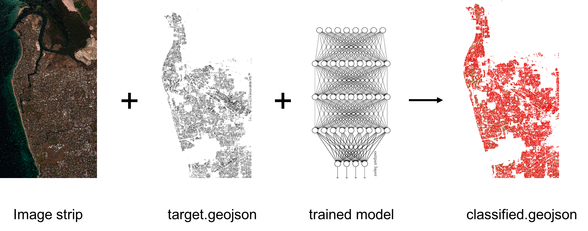
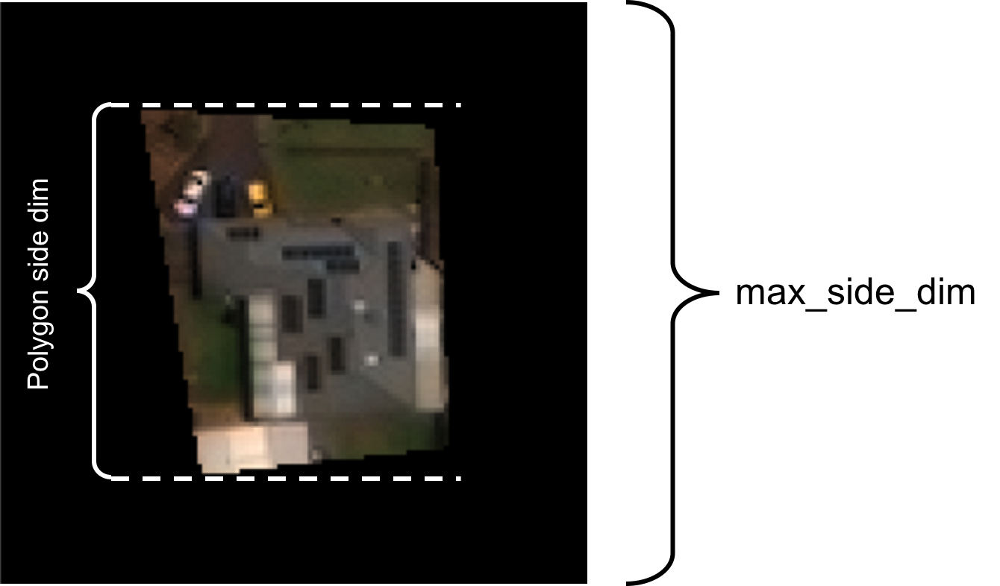

# deploy-cnn-classifier

Deploys a trained Convolutional Neural Network (CNN) classifier on a set of target polygons in a geojson file. The task returns a geojson file 'classified.geojson' containing the input polygons, each with a classification result and confidence score. The input model is a trained [Keras CNN](https://keras.io/) that should be obtained from [train-cnn-classifier](https://github.com/PlatformStories/train-cnn-classifier).



## Run  

Here we run though a sample execution of the deploy-cnn-classifier task. We will be deploying a model that classifies property polygons as 'Swimming pool' or 'No swimming pool'. All of the input data is available in the S3 locations specified below.

1. Within an iPython terminal create a GBDX interface an specify the task input location:  

    ```python
    from gbdxtools import Interface
    from os.path import join
    import uuid

    gbdx = Interface()

    input_location = 's3://gbd-customer-data/58600248-2927-4523-b44b-5fec3d278c09/platform-stories/deploy-cnn-classifier'
    ```

2. Create a task instance and set the required [inputs](#inputs):  

    ```python
    deploy_task = gbdx.Task('deploy-cnn-classifier')
    deploy_task.inputs.model = join(input_location, 'model')
    deploy_task.inputs.images = join(input_location, 'images')
    deploy_task.inputs.geojson = join(input_location, 'geojson')
    ```

3. Specify the classes for the deploy task. We can also restrict the size of polygons that we deploy on and set the appropriate bit depth for the input imagery:  

    ```python
    deploy_task.inputs.classes = 'No swimming pool, Swimming pool'
    deploy_task.inputs.bit_depth = '8'
    deploy_task.inputs.min_side_dim = '10'
    ```

4. Initialize a workflow and specify where to save the output:  

    ```python
    deploy_wf = gbdx.Workflow([deploy_task])
    random_str = str(uuid.uuid4())
    output_location = join('platform-stories/trial-runs', random_str)

    deploy_wf.savedata(deploy_task.outputs.classified_geojson, join(output_location, 'classified_geojson'))
    ```

5. Execute the workflow:  

    ```python
    deploy_wf.execute()
    ```

6. Track the status of the workflow as follows:

    ```python
    deploy_wf.status
    ```


## Input Ports

The following table lists the input ports of deploy-cnn-classifier. Note that booleans, integers and floats **must be** passed to the task as strings, e.g., 'True', '10', '0.001'.

| Name | Default | Valid Values | Description |
|------|---------|--------------|-------------|
| images | N/A | N/A | Contains the tif image strips on which to deploy the classifier. The strips must be named after their catalog ids (ex- 1040010014BCA700.tif). Up to five image strips will be accepted as input. |
| geojson | N/A | N/A | Contains a geojson file with the polygons to be classified. Each polygon should have an 'image_id' property containing the catalog id of the associated image strip. |
| model | N/A | N/A | Contains the trained model that will be used to classify the polygons in geojson_file. This location should contain the model architecture (in json format) and the trained weights (in h5 format). |
| classes | None | String | The classes to sort each polygon into. Different class names should be separated by commas and must be in the same order that the model was trained on (e.g- 'No swimming pool, Swimming pool'). If this is omitted the classes will be numerical. |
| bit_depth | 8 | integer > 0 | Bit depth of the input imagery. This is necessary for proper normalization of the input to the network. |
| min_side_dim | 0 | integer >= 0 | Minimum acceptable side dimension (in pixels) of polygons to classify. |


## Output Ports

deploy-cnn-classifier has one output directory port, classified_shapefile, where classified.geojson is stored.


## Advanced

#### Polygon Size Restriction

A polygon's side dimensions are determined by it's bounding box size. If the width or height of a polygon chip exceeds the input chip size to the network it will be omitted from classified.geojson. Additionally, if the min_side_dim argument is used, any polygon with a smaller side dimension will be omitted from the output file.



It is recommended that you filter the input geojson beforehand as follows:

```python
from mltools import geojson_tools as gt
gt.filter_polygon_size(input_shapefile, output_filename, min_side_dimension, max_side_dimension)
```

#### Classes

The classes argument is simply a naming convention. If this is left blank class names will be an integer between 0 and N - 1, where N is the number of classes. If you prefer that classified.geojson contain class names as strings, you may input these class names exactly how you want them to appear. It is essential that the class names be in the same order as the class list on which you trained your model.  

## Development

### Build the Docker Image

You need to install [Docker](https://docs.docker.com/engine/installation/).

Clone the repository:

```bash
git clone https://github.com/platformstories/deploy-cnn-classifier
```

Then:

```bash
cd deploy-cnn-classifier
docker build -t deploy-cnn-classifier .
```

### Try out locally

Create a container in interactive mode and mount the sample input under `/mnt/work/input/`:

```bash
docker run -v full/path/to/sample-input:/mnt/work/input -it deploy-cnn-classifier
```

Then, within the container:

```bash
python /deploy-cnn-classifier.py
```

Watch the stdout to confirm that the model is being trained.


### Docker Hub

Login to Docker Hub:
```bash
docker login
```

Tag your image using your username and push it to DockerHub:

```bash
docker tag deploy-cnn-classifier yourusername/deploy-cnn-classifier
docker push yourusername/deploy-cnn-classifier
```

The image name should be the same as the image name under containerDescriptors in deploy-cnn-classifier.json.

Alternatively, you can link this repository to a [Docker automated build](https://docs.docker.com/docker-hub/builds/). Every time you push a change to the repository, the Docker image gets automatically updated.


### Register on GBDX

In a Python terminal:

```python
from gbdxtools import Interface
gbdx = Interface()
gbdx.task_registry.register(json_filename='deploy-cnn-classifier.json')
```

Note: If you change the task image, you need to reregister the task with a higher version number in order for the new image to take effect. Keep this in mind especially if you use Docker automated build.
